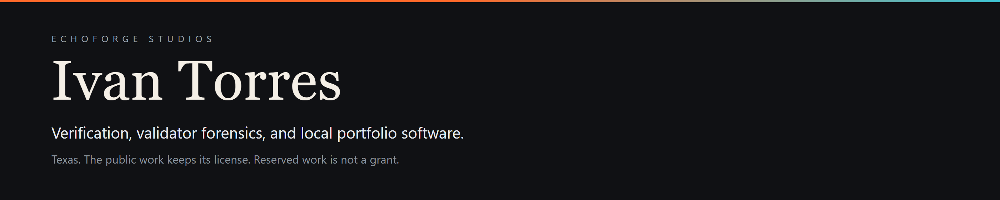
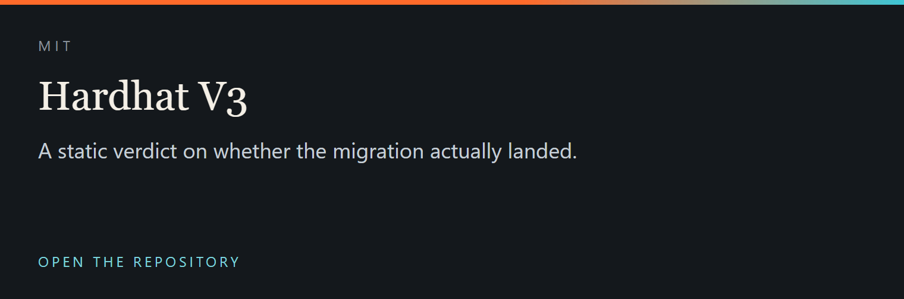
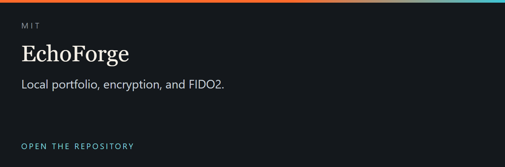
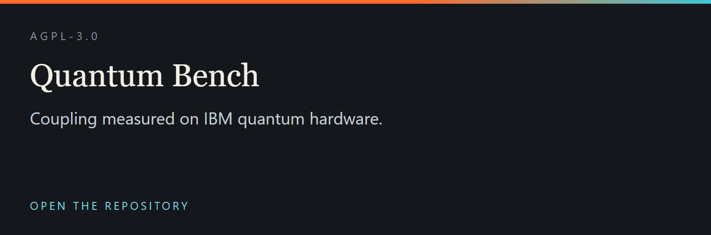
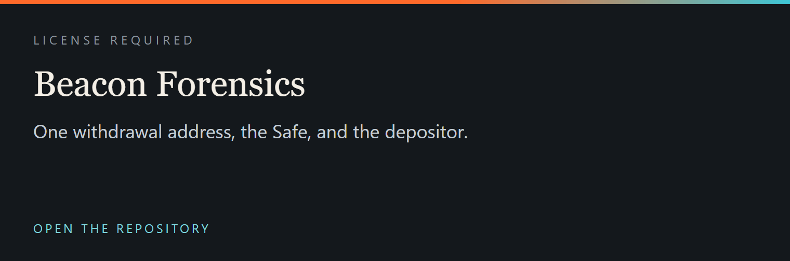
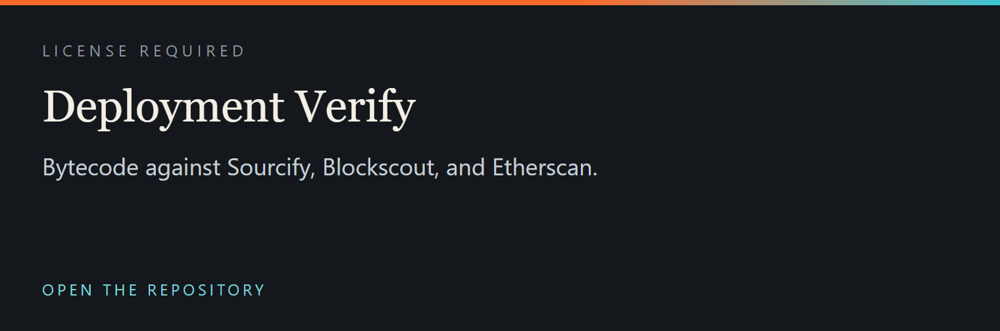
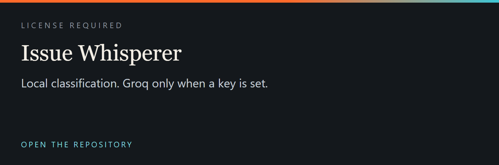
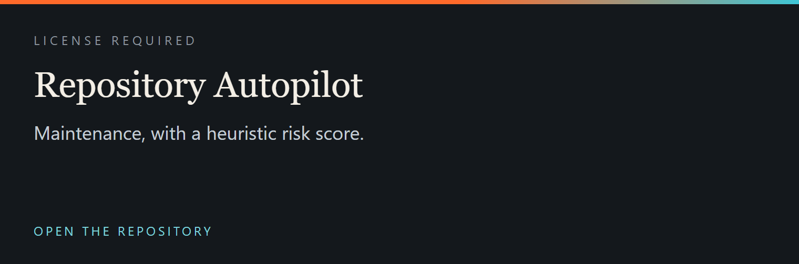
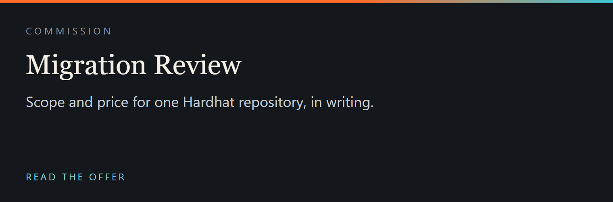

  

  

  

  
  

  
  

  
  

  
  

  Reserved terms are the LICENSE file in
  <a href="https://github.com/ivan09069/beacon-forensics/blob/master/LICENSE">beacon-forensics</a>,
  <a href="https://github.com/ivan09069/eth-deployment-verify/blob/master/LICENSE">eth-deployment-verify</a>,
  <a href="https://github.com/ivan09069/issue-whisperer/blob/main/LICENSE">issue-whisperer</a>,
  and
  <a href="https://github.com/ivan09069/gh-autopilot/blob/master/LICENSE">gh-autopilot</a>.

