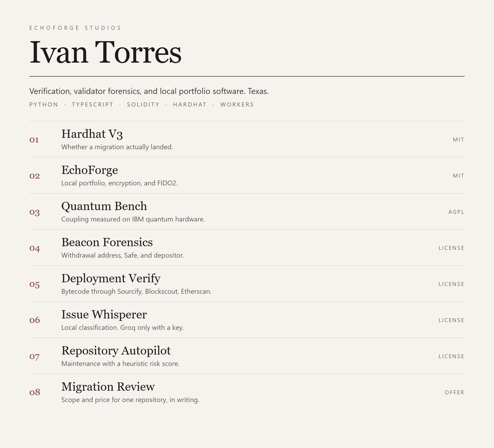

  

  <a href="https://github.com/ivan09069/hardhat-v3-migration-validator">Hardhat V3</a>
  &nbsp;&middot;&nbsp;
  <a href="https://github.com/ivan09069/EchoForge">EchoForge</a>
  &nbsp;&middot;&nbsp;
  <a href="https://github.com/ivan09069/quantum-bench">Quantum Bench</a>
  &nbsp;&middot;&nbsp;
  <a href="https://github.com/ivan09069/beacon-forensics">Beacon Forensics</a>
  &nbsp;&middot;&nbsp;
  <a href="https://github.com/ivan09069/eth-deployment-verify">Deployment Verify</a>
   
  <a href="https://github.com/ivan09069/issue-whisperer">Issue Whisperer</a>
  &nbsp;&middot;&nbsp;
  <a href="https://github.com/ivan09069/gh-autopilot">Repository Autopilot</a>
  &nbsp;&middot;&nbsp;
  <a href="https://github.com/ivan09069/hardhat-v3-migration-validator/blob/master/SERVICE_OFFER.md">Migration Review</a>

